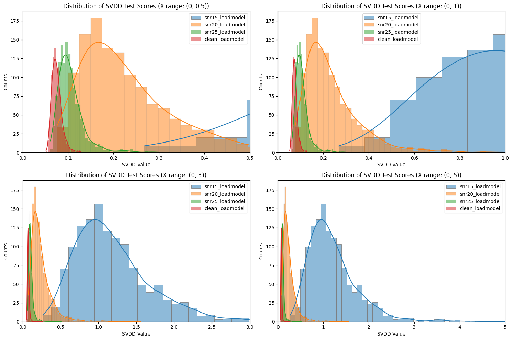

# SVDD

This SVDD (Support Vector Data Description) system is forked from Deep-SVDD-PyTorch (https://github.com/lukasruff/Deep-SVDD-PyTorch).

When provided with a clean 20-dimensional (20 scores per audio file) npz file as training data and a 20-dimensional npz file for inference as testing data, the system will generate a non-negative value for each audio file requiring inference. The closer this value is to 0, the cleaner the audio; the further it is from 0, the noisier the audio.

Note that the system is optimized for GPU acceleration, ensuring faster performance.

## Setting up the Environment

1. Create a conda environment:

```
conda create -n svdd python=3.10
```

2. Activate the conda environment:

```
conda activate svdd
```

3. Install required packages:

4. Since this training system requires data in the `.npz` format, we first convert the desired training/testing CSV files (from the MOS system) into `.npz` format. (Change the target files `file_paths` in `csv_to_npz.py`.)

```
python SVDD/csv_to_npz.py
```

5. Make the required directory:

```
mkdir SVDD/log
```

6. Sign up for an account at https://wandb.ai/site.

## Executing Training

1. Change the clean and fixed training set at `SVDD/src/datasets/lang_emb.py`, `class LangEmbDataset` `train_set`.

2. Update the testing & inference set at `SVDD/src/datasets/lang_emb.py`, `class LangEmbDataset` `test_set`.

3. Update the testing & inference result file at `SVDD/src/npz_to_json.py`, line 201.

4. Start training (need to log in wandb in the first time):

```
cd SVDD/src
python npz_to_json.py
```

## Result

1. See the result JSON files and the model in `SVDD/log/`.

2. run `json_distribution.ipynb`
   
